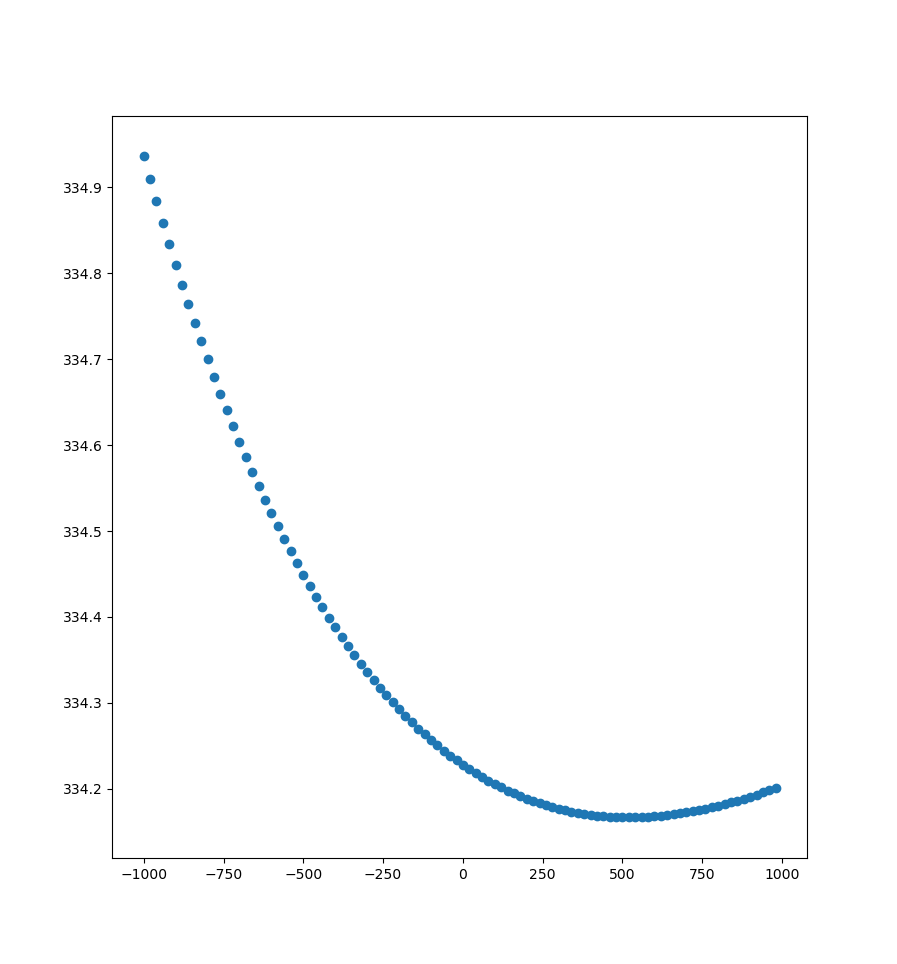

# Data Science Foundations

<div align="center">
  
</div>

<p align="center">

  <h3 align="center">Data Science Foundations</h3>

  <p align="center">
    implementation of linear and polynomial regression
    <br />
    <a href="https://github.com/RikilG/Data-Science-Foundations"><strong>Explore the docs »</strong></a>
    <br />
    <br />
    <a href="https://github.com/RikilG/Data-Science-Foundations/issues">Report Bug</a>
    ·
    <a href="https://github.com/RikilG/Data-Science-Foundations/issues">Request Feature</a>
  </p>
</p>


## Table of Contents

- [Data Science Foundations](#data-science-foundations)
  - [Table of Contents](#table-of-contents)
  - [About The Project](#about-the-project)
  - [Getting Started](#getting-started)
    - [Prerequisites](#prerequisites)
    - [Dependencies](#dependencies)
    - [Installation](#installation)
  - [License](#license)
  - [Contact](#contact)


## About The Project

This project implements Polynomial regression using the method of Gradient Descent and Normal Equations for user given dataset and degree(use 1 for linear regression).
For testing the model, this [dataset](https://archive.ics.uci.edu/ml/datasets/3D+Road+Network+%28North+Jutland%2C+Denmark%29) is used

Built With [Python](https://python.org)


## Getting Started

To get a local copy up and running follow these simple steps.

### Prerequisites

Things you need to use the project and how to install them:
* python3
```sh
# skip this if you already have python > 3.4 installed
sudo apt install python python3
```

### Dependencies

List of dependencies present/used in the project
 - [numpy](https://numpy.org)
 - [pandas](https://pandas.pydata.org)
 - [matplotlib](https://matplotlib.org)


### Installation
 
1. Clone the repository
```sh
git clone https://github.com/RikilG/Data-Science-Foundations.git
cd Data-Science-Foundations
```
2. Install/update dependencies
```sh
# if using anaconda, replace pip with conda
pip install numpy
pip install pandas
pip install matplotlib
```
3. Run the project
  - set the degree
  - set the method to 
    - L1GD(Lasso Regression)
    - L2GD(Ridge Regression)
    - GD (Gradient Descent)
    - SGD (Stocastic Gradient Descent)
    - NE (Normal Equations)
  - Then run the project using:
```sh
python main.py
```

## License

Distributed under the MIT License. See `LICENSE` for more information.


## Contact

RikilG: [Github](https://github.com/RikilG/) | [Site](https://riklg.github.io)

Project Link: [https://github.com/RikilG/Data-Science-Foundations](https://github.com/RikilG/Data-Science-Foundations)